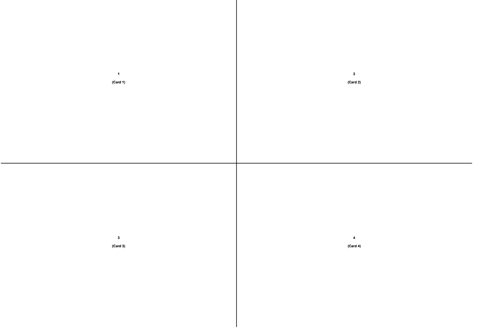
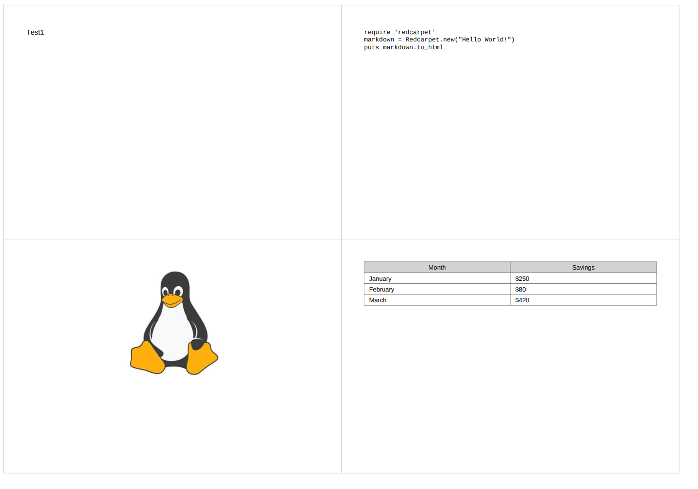

# Markdown Flashcards Generator

A command-line tool that converts Markdown notes (optimized for Obsidian) into printable 2x2 PDF flashcards and importable Anki decks. 




## Features
- **Native Markdown Parsing**: Supports tables, lists, bold/italics, and ` ``` ` code blocks.
- **Obsidian Friendly**: Automatically handles `![[image.png]]` syntax.
- **Smart PDF Layout**: Auto-scales text to fit the 2x2 grid without overflowing.
- **Anki Integration**: Generates `.apkg` files with subdecks and proper formatting.
- **Stable IDs**: Uses hashing for deck IDs so you don't lose your Anki study progress when updating notes.

## Usage

```bash
uv sync
uv run flashcards.py path/to/your_notes.md
'''

## bash Options
--anki - Generate an Anki .apkg deck alongside the PDF.

-n, --name - Custom output filename (e.g., -n "My_Course"). Defaults to the input file's name.

## Expected Markdown Format
The script uses # for Deck/Subdeck names and ## for the front of the flashcard. Everything underneath the ## heading until the next heading becomes the answer.

## Markdown
'''
#Software Engineering (Subdeck Name)


## What is Clean Code?
- Elegant and efficient
- Simple and straightforward
- Does **one thing** well

## Explain the Single Responsibility Principle
It states that a class should have one, and only one, reason to change.
Images
If your cards use images, place them in an attachments/ folder in the same directory as your input Markdown file.
'''


## Plaintext
my_notes/
├── Zusammenfassung.md
└── attachments/
    ├── diagram.png
    └── chart.jpg
    
    
## How to Print (Double-Sided)
- The PDF is specifically generated in Landscape mode with the answer columns pre-swapped (left-to-right) so they align perfectly when printed.
- To print them correctly for physical cut-outs:
- Open the print dialog in your PDF viewer.
- Set Paper Size to A4 and Orientation to Landscape.
- Enable Double-sided printing (Duplex).
- Set the binding/flip direction to Flip on Short Edge (sometimes called "Bind on Short Edge").
- Print at 100% scale (Do not use "Fit to Page", or the margins won't align perfectly when cutting).
